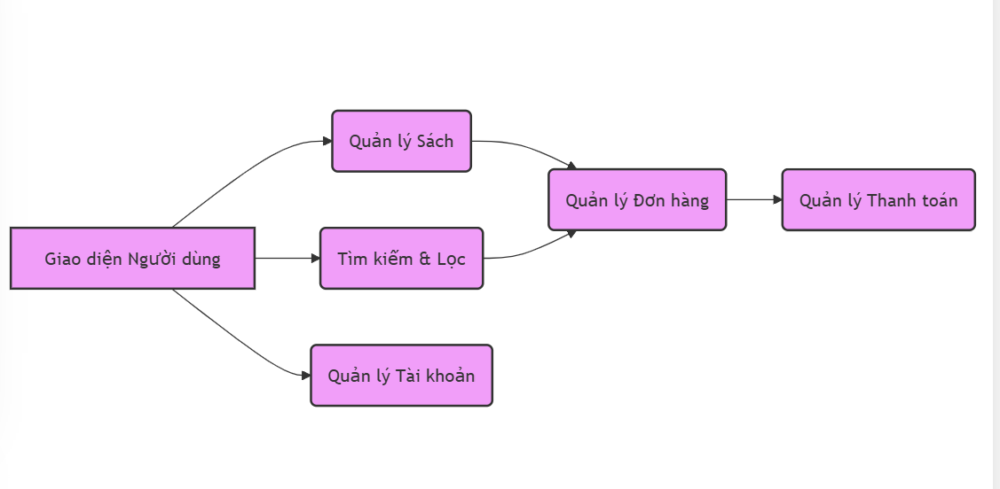
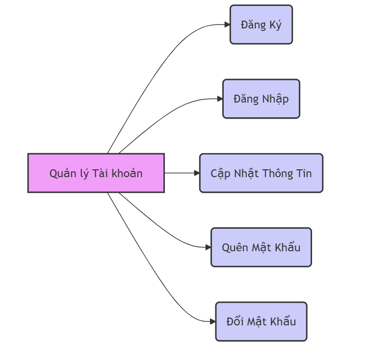
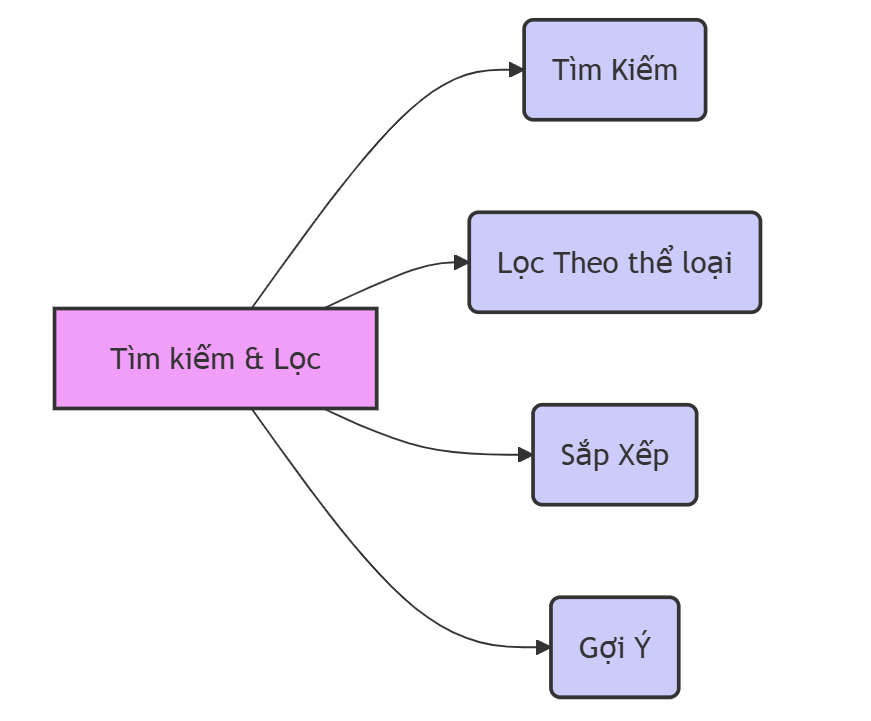
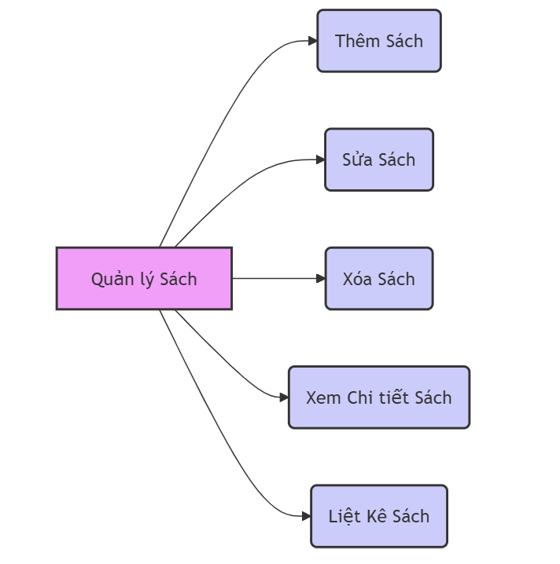
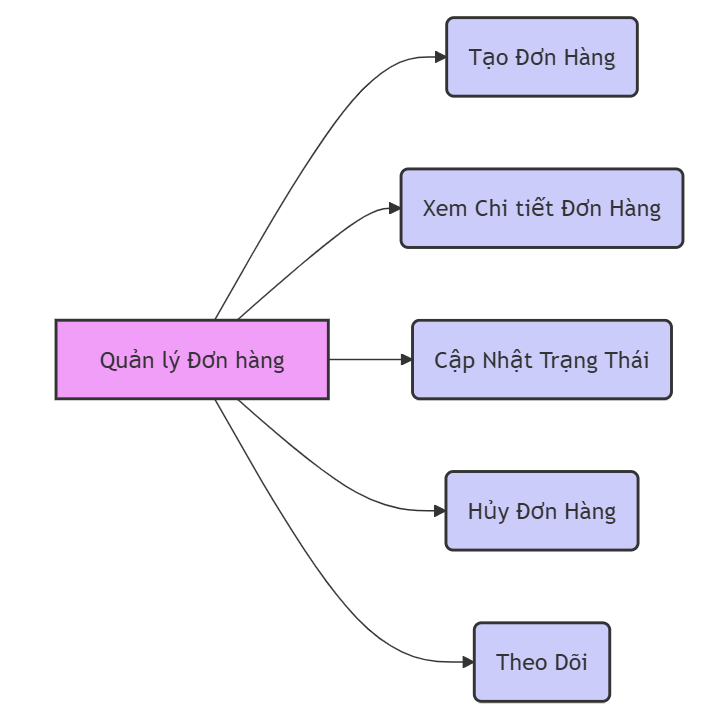
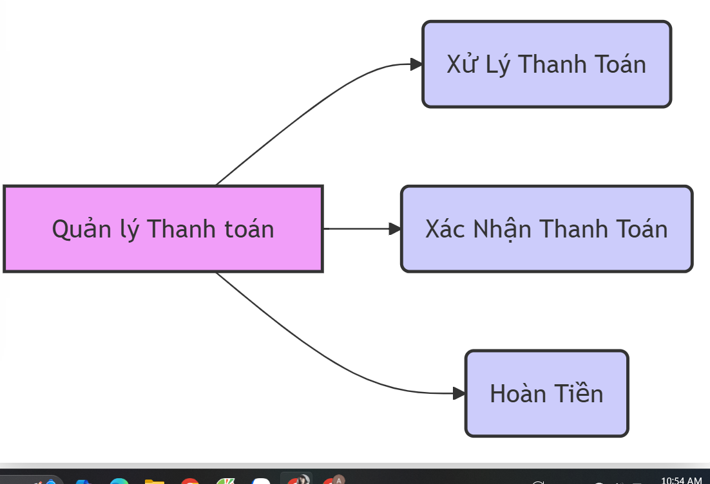

# Web bán sách BookHaven
## Thành viên 
- Mai Phương Anh
## Giới thiệu
Dự án phần mềm website BookHaven sẽ mang đến trải nghiệm mua sắm sách cá nhân hóa và tiện lợi, với giao diện tối giản và thân thiện. Khách hàng có thể dễ dàng tìm kiếm sách qua thanh tìm kiếm thông minh. Các tính năng như giỏ hàng, thanh toán đa dạng, theo dõi đơn hàng sẽ giúp quá trình mua sắm mượt mà và nhận hỗ trợ trực tuyến khi cần thiết.
## Đối tượng người dùng
- Người dùng (Users)
  + Khách Hàng: Những người truy cập và mua sách từ trang web. Họ có thể tạo tài khoản để theo dõi đơn hàng, lưu danh sách sách yêu thích, và nhận thông tin cập nhật về các ưu đãi hoặc sách mới.
  + Khách (người dùng chưa đăng nhập): Những người chỉ vào xem và tìm kiếm sách cụ thể, đọc các đánh giá, và tìm hiểu thông tin về tác giả hoặc sách.
- Quản trị viên (Admins)
  + Quản Trị Viên Chính: Những người quản lý toàn bộ trang web, bao gồm cập nhật nội dung, quản lý danh mục sách, xử lý đơn hàng, và giám sát các vấn đề kỹ thuật.
  + Nhân Viên Hỗ Trợ Khách Hàng: Những người hỗ trợ khách hàng qua email, chat, hoặc điện thoại, giải đáp thắc mắc và xử lý các vấn đề liên quan đến đơn hàng.
## Tính năng
1. Giao diện và Trải nghiệm Người dùng
  + Thiết kế tối giản và thân thiện: Giao diện cần dễ nhìn và không quá phức tạp để người dùng có thể tập trung vào việc tìm kiếm và mua sách.
  + Thanh tìm kiếm thông minh: Hỗ trợ tìm kiếm theo tiêu đề, tác giả, thể loại 
2. Phân loại và Tổ chức Sách
  + Danh mục rõ ràng: Sắp xếp sách theo thể loại 
3. Tính năng Mua hàng và Thanh toán
  + Giỏ hàng: Người dùng có thể thêm sách vào giỏ hàng hoặc danh sách yêu thích để mua sau.
  + Thanh toán đa dạng: Hỗ trợ thanh toán chuyển khoản, thanh toán khi nhận hàng.
  + Theo dõi đơn hàng: Cho phép người mua theo dõi quá trình vận chuyển và trạng thái đơn hàng.
## Sơ đồ chức năng
1. Sơ đồ chức năng
   
2. Sơ đồ giao diện người dùng
   
3. Sơ đồ tài khoản
   
4. Sơ đồ tìm kiếm
   
5. Sơ đồ quản lý sách
   
6. Sơ đồ quản lý đơn hàng
   
7. Sơ đồ quản lý thanh toán
   
## Công nghệ sử dụng
1. Giao diện: HTML, CSS, JavaScript
2. PhP, Laravel framework
3. Cơ sở dữ liệu: MySQL
