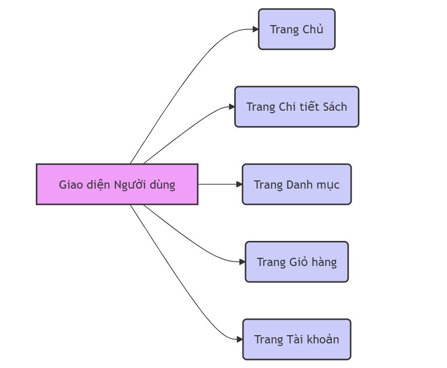

# Web bán sách BookHaven

## Thành viên

- Mai Phương Anh

## Giới thiệu

Dự án phần mềm website BookHaven sẽ mang đến trải nghiệm mua sắm sách cá nhân hóa và tiện lợi, với giao diện tối giản và thân thiện. Khách hàng có thể dễ dàng tìm kiếm sách qua thanh tìm kiếm thông minh. Các tính năng như giỏ hàng, thanh toán đa dạng, theo dõi đơn hàng sẽ giúp quá trình mua sắm mượt mà và nhận hỗ trợ trực tuyến khi cần thiết.

## Đối tượng người dùng

- Người dùng (Users)
  + Khách Hàng: Những người truy cập và mua sách từ trang web. Họ có thể tạo tài khoản để theo dõi đơn hàng, lưu danh sách sách yêu thích, và nhận thông tin cập nhật về các ưu đãi hoặc sách mới.
  + Khách (người dùng chưa đăng nhập): Những người chỉ vào xem và tìm kiếm sách cụ thể, đọc các đánh giá, và tìm hiểu thông tin về tác giả hoặc sách.
- Quản trị viên (Admins)
  + Quản Trị Viên Chính: Những người quản lý toàn bộ trang web, bao gồm cập nhật nội dung, quản lý danh mục sách, xử lý đơn hàng, và giám sát các vấn đề kỹ thuật.
  + Nhân Viên Hỗ Trợ Khách Hàng: Những người hỗ trợ khách hàng qua email, chat, hoặc điện thoại, giải đáp thắc mắc và xử lý các vấn đề liên quan đến đơn hàng.

## Tính năng

1.  Giao diện và Trải nghiệm Người dùng
    + Thiết kế tối giản và thân thiện: Giao diện cần dễ nhìn và không quá phức tạp để người dùng có thể tập trung vào việc tìm kiếm và mua sách.
    + Thanh tìm kiếm thông minh: Hỗ trợ tìm kiếm theo tiêu đề, tác giả, thể loại
2.  Phân loại và Tổ chức Sách
    + Danh mục rõ ràng: Sắp xếp sách theo thể loại
3.  Tính năng Mua hàng và Thanh toán
    + Giỏ hàng: Người dùng có thể thêm sách vào giỏ hàng hoặc danh sách yêu thích để mua sau.
    + Thanh toán đa dạng: Hỗ trợ thanh toán chuyển khoản, thanh toán khi nhận hàng.
    + Theo dõi đơn hàng: Cho phép người mua theo dõi quá trình vận chuyển và trạng thái đơn hàng.

## Sơ đồ chức năng

1.  Sơ đồ chức năng

    

2.  Sơ đồ giao diện người dùng

    

3.  Sơ đồ tài khoản

    

4.  Sơ đồ tìm kiếm

    

5.  Sơ đồ quản lý sách

    

6.  Sơ đồ quản lý đơn hàng

    

7.  Sơ đồ quản lý thanh toán

    

## Công nghệ sử dụng

1.  Giao diện: HTML, CSS, JavaScript
2.  PhP, Laravel framework
3.  Cơ sở dữ liệu: MySQL

---

## About Laravel

Laravel is a web application framework with expressive, elegant syntax. We believe development must be an enjoyable and creative experience to be truly fulfilling. Laravel takes the pain out of development by easing common tasks used in many web projects, such as:

-   [Simple, fast routing engine](https://laravel.com/docs/routing).
-   [Powerful dependency injection container](https://laravel.com/docs/container).
-   Multiple back-ends for [session](https://laravel.com/docs/session) and [cache](https://laravel.com/docs/cache) storage.
-   Expressive, intuitive [database ORM](https://laravel.com/docs/eloquent).
-   Database agnostic [schema migrations](https://laravel.com/docs/migrations).
-   [Robust background job processing](https://laravel.com/docs/queues).
-   [Real-time event broadcasting](https://laravel.com/docs/broadcasting).

Laravel is accessible, powerful, and provides tools required for large, robust applications.

## Learning Laravel

Laravel has the most extensive and thorough [documentation](https://laravel.com/docs) and video tutorial library of all modern web application frameworks, making it a breeze to get started with the framework.

You may also try the [Laravel Bootcamp](https://bootcamp.laravel.com), where you will be guided through building a modern Laravel application from scratch.

If you don't feel like reading, [Laracasts](https://laracasts.com) can help. Laracasts contains thousands of video tutorials on a range of topics including Laravel, modern PHP, unit testing, and JavaScript. Boost your skills by digging into our comprehensive video library.

## Laravel Sponsors

We would like to extend our thanks to the following sponsors for funding Laravel development. If you are interested in becoming a sponsor, please visit the [Laravel Partners program](https://partners.laravel.com).

### Premium Partners

-   **[Vehikl](https://vehikl.com/)**
-   **[Tighten Co.](https://tighten.co)**
-   **[WebReinvent](https://webreinvent.com/)**
-   **[Kirschbaum Development Group](https://kirschbaumdevelopment.com)**
-   **[64 Robots](https://64robots.com)**
-   **[Curotec](https://www.curotec.com/services/technologies/laravel/)**
-   **[Cyber-Duck](https://cyber-duck.co.uk)**
-   **[DevSquad](https://devsquad.com/hire-laravel-developers)**
-   **[Jump24](https://jump24.co.uk)**
-   **[Redberry](https://redberry.international/laravel/)**
-   **[Active Logic](https://activelogic.com)**
-   **[byte5](https://byte5.de)**
-   **[OP.GG](https://op.gg)**

## Contributing

Thank you for considering contributing to the Laravel framework! The contribution guide can be found in the [Laravel documentation](https://laravel.com/docs/contributions).

## Code of Conduct

In order to ensure that the Laravel community is welcoming to all, please review and abide by the [Code of Conduct](https://laravel.com/docs/contributions#code-of-conduct).

## Security Vulnerabilities

If you discover a security vulnerability within Laravel, please send an e-mail to Taylor Otwell via [taylor@laravel.com](mailto:taylor@laravel.com). All security vulnerabilities will be promptly addressed.

## License

The Laravel framework is open-sourced software licensed under the [MIT license](https://opensource.org/licenses/MIT).